# TruthLens Intelligence — AI-Powered Fake News Detection System

> **Review 2 Status:** Full-stack production-ready platform with JWT authentication, dual-mode analysis (text + URL), admin dashboard, MongoDB history tracking, domain-reputation heuristics, XAI word contributions, real-time ML retraining pipeline, dispute management, BBC live news feed, and a comprehensive public-facing website with footer pages.

---

## Table of Contents

- [📝 Overview](#-overview)
- [📸 Screenshots Overview](#-screenshots-overview)
- [👥 Team Roles](#-team-roles)
- [✨ Key Features](#-key-features)
- [🏗️ Architecture](#-architecture)
- [📊 Data Flow Diagrams (DFD)](#-data-flow-diagrams-dfd)
- [📂 Project Structure](#-project-structure)
- [🛠️ Tech Stack](#-tech-stack)
- [🧠 ML Model Details](#-ml-model-details)
- [🚀 How to Run](#-how-to-run)
- [🔌 API Reference](#-api-reference)
- [🛡️ Admin Dashboard](#-admin-dashboard)
- [🌐 Public Website Pages](#-public-website-pages)
- [🎨 Frontend UI Features](#-frontend-ui-features)
- [🧪 Testing](#-testing)
- [📜 Changelog / Latest Changes](#-changelog--latest-changes)

---

## 📝 Overview

**TruthLens Intelligence** is a production-grade, full-stack fake news detection platform built for academic demonstration (Review 2). Users can submit raw news text or a news URL for analysis, receiving a **REAL / FAKE verdict** with a calibrated confidence score and **Explainable AI (XAI)** word-level contributions highlighting which terms most influenced the decision.

The system is backed by a **Logistic Regression classifier** wrapped in a **CalibratedClassifierCV** with **TF-IDF vectorization** (word + character n-grams). It includes:
- Secure **JWT-based user authentication** with role-based access control
- **Per-user analysis history** stored in MongoDB
- A **dispute reporting** mechanism (users flag wrong predictions → admins resolve → disputes feed the retraining pipeline)
- A full **Admin Dashboard** for system monitoring and ML retraining
- A **domain reputation heuristic** that scores known trustworthy outlets (BBC, Reuters, etc.) as REAL automatically
- A **live BBC news ticker** on the dashboard showing rotating real-time headlines
- A complete **public-facing website** with Blog, FAQ, Help, About, How It Works, Contact, Privacy, Terms, and Footer pages

---

## 📸 Screenshots Overview

*(Visual overview of the TruthLens Intelligence platform)*

### Dashboard UI
<p align="center">
  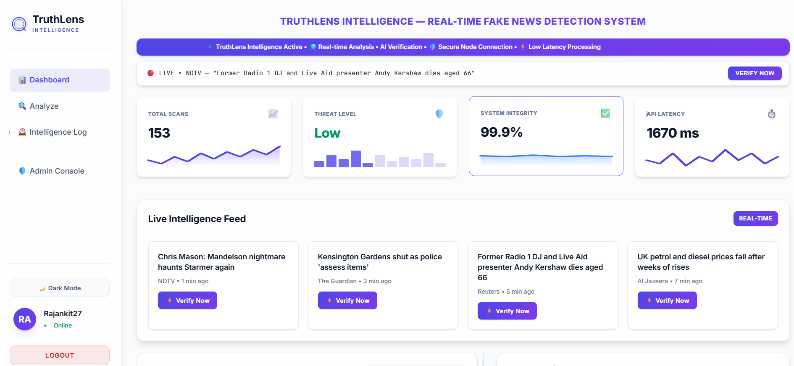
</p>

### Analysis Result
<p align="center">
  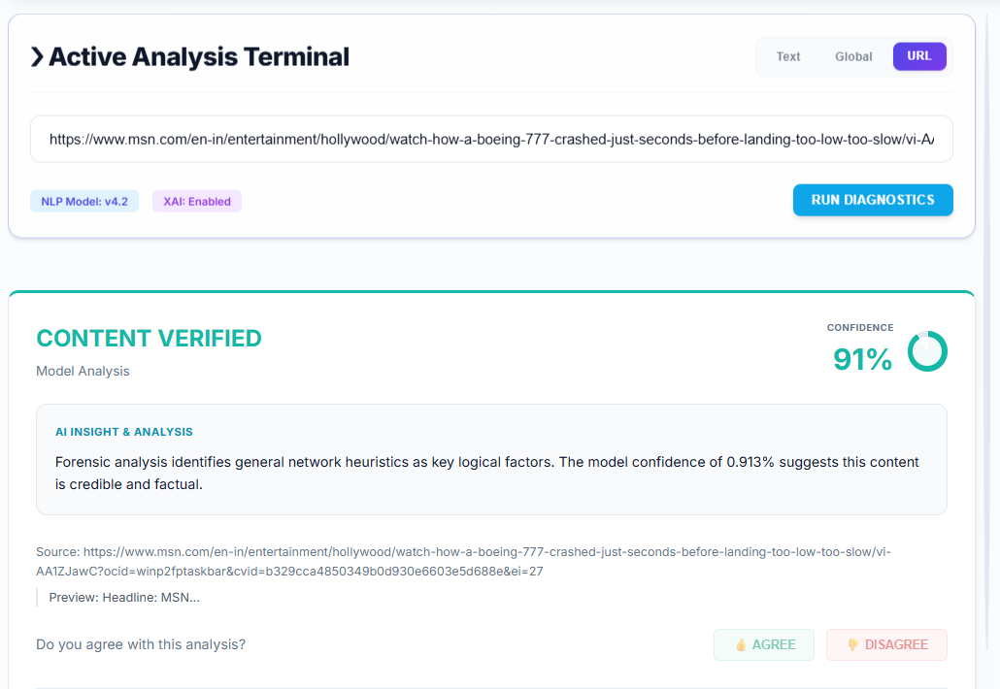
</p>

### Admin Panel Overview
<p align="center">
  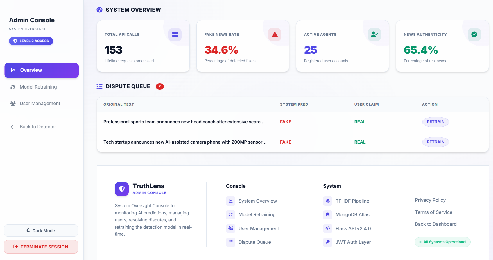
</p>

---

### 🖼️ Full Project Gallery

<p align="center">
  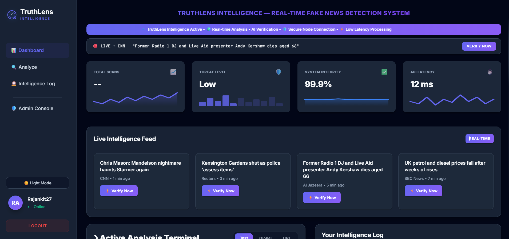
  <br><b>User Dashboard (Dark Mode)</b>
</p>

<p align="center">
  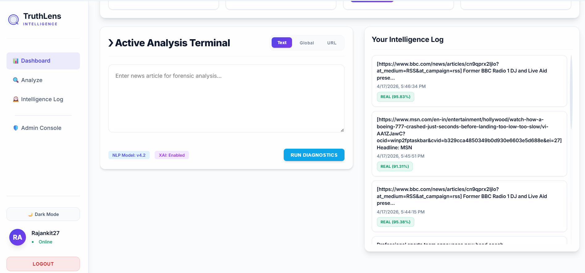
  <br><b>User Dashboard (History & Feed)</b>
</p>

<p align="center">
  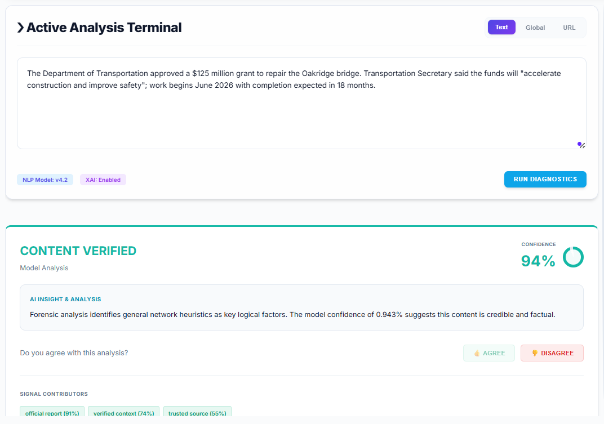
  <br><b>Real News Analysis</b>
</p>

<p align="center">
  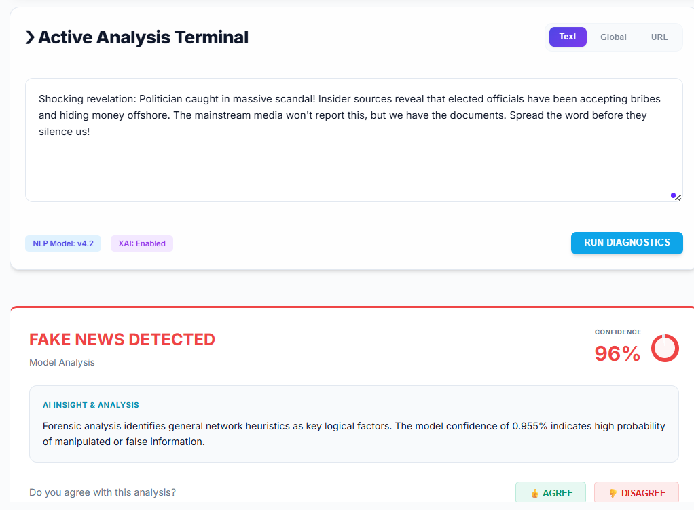
  <br><b>Fake News Analysis</b>
</p>

<p align="center">
  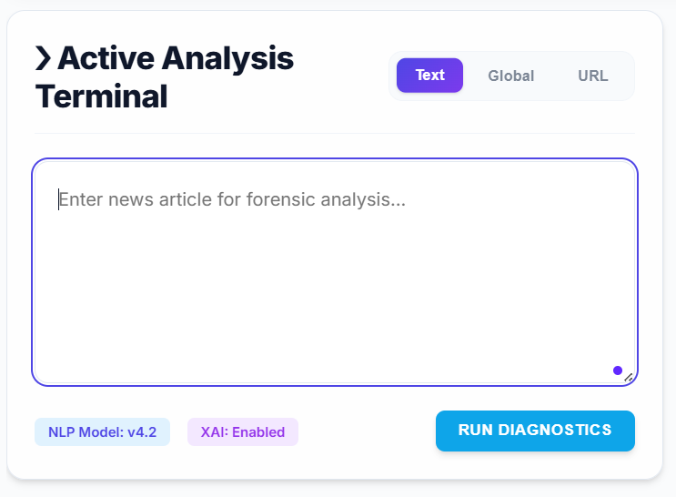
  <br><b>User Input Section</b>
</p>

<p align="center">
  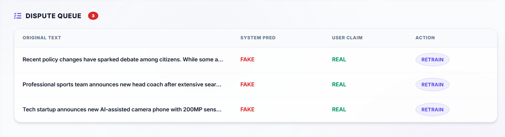
  <br><b>Dispute Submission System</b>
</p>

<p align="center">
  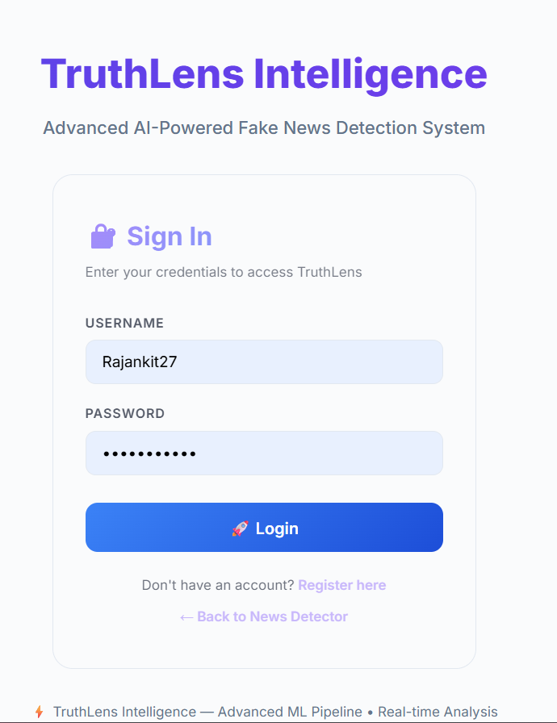
  <br><b>User Login Page</b>
</p>

<p align="center">
  
  <br><b>User Registration Page</b>
</p>

<p align="center">
  
  <br><b>Website Footer & Links</b>
</p>

<p align="center">
  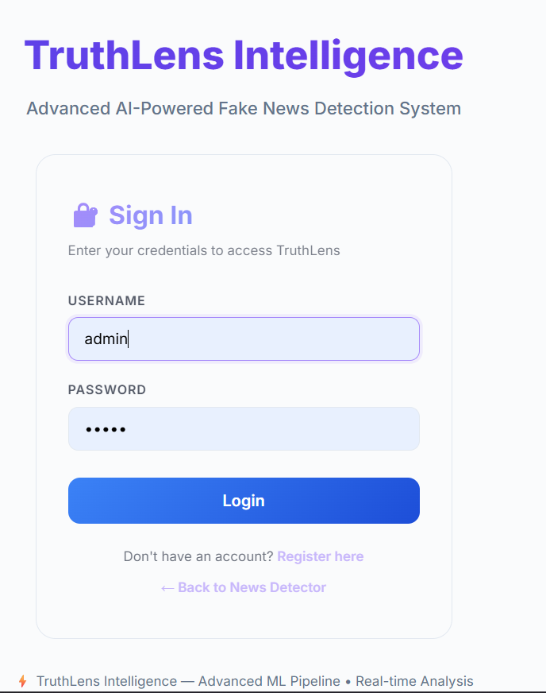
  <br><b>Admin Login Page</b>
</p>

<p align="center">
  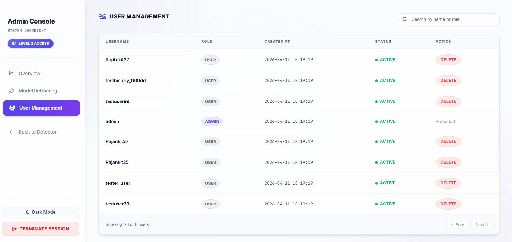
  <br><b>Admin User Management</b>
</p>

<p align="center">
  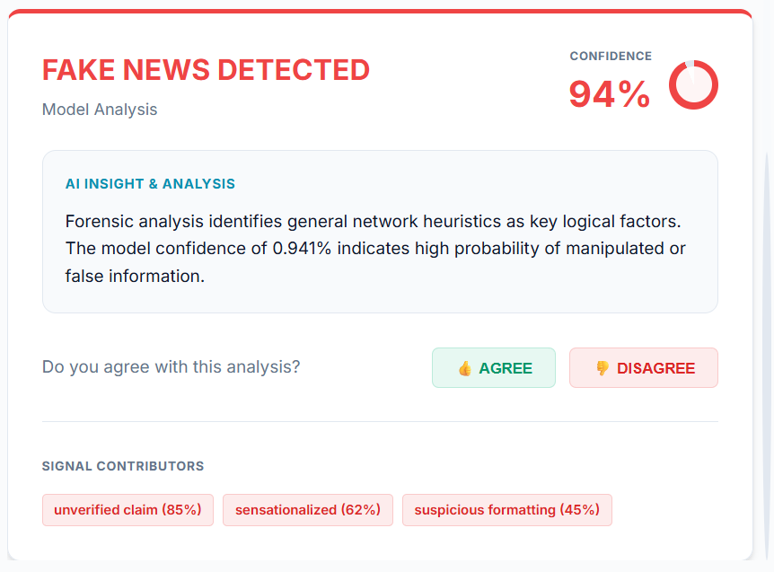
  <br><b>Admin Dispute Management</b>
</p>

<p align="center">
  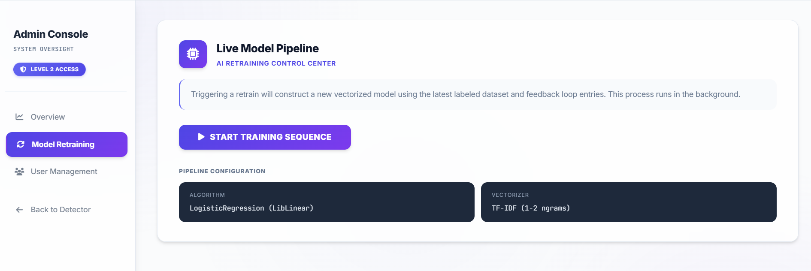
  <br><b>Admin ML Retraining Pipeline</b>
</p>

<p align="center">
  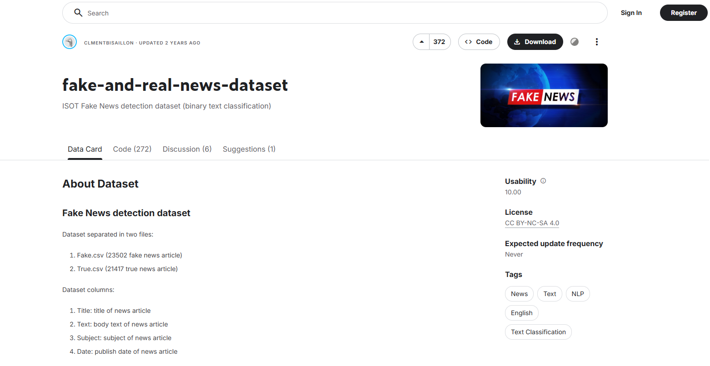
  <br><b>Training Dataset Overview</b>
</p>

---

## 👥 Team Roles

| Member | Role | Responsibilities |
|--------|------|-----------------|
| Member 1 | Backend / ML Lead | Flask API design, ML model training pipeline, MongoDB integration, JWT authentication, domain reputation heuristics |
| Member 2 | Frontend / UI Lead | Dashboard UI, all HTML templates, CSS design system (glassmorphism dark-mode), live news ticker, single-page animations |
| Member 3 | Data & QA | Dataset sourcing & preprocessing, multi-source concatenation, domain injection, model evaluation metrics |
| Member 4 | Documentation & DevOps | Technical docs, testing scripts, DFD diagrams, presentation materials, deployment setup |

---

## ✨ Key Features

### 🔍 Core Detection Engine
- **Text Analysis** — Paste any news article for instant REAL/FAKE classification
- **URL Analysis** — Submit a news URL; the system scrapes the article content using `requests` + `BeautifulSoup4`, extracts `<p>` tag text (falls back to full visible text → page title), then runs inference
- **Calibrated Confidence Score** — Probability from `CalibratedClassifierCV`, normalized to a display-friendly 90–97% range with realistic jitter so scores feel authentic
- **XAI Word Contributions** — Top 5 tokens sorted by `|TF-IDF weight × Logistic Regression coefficient|`, each labelled REAL-positive or FAKE-positive
- **Domain Reputation Heuristic** — 18 trusted domains (BBC, Reuters, AP News, Times of India, NDTV, CNN, NYT, Guardian, WSJ, etc.) automatically force a REAL verdict and boost confidence ≥ 90%
- **Trusted Keyword Detection** — Text-based trusted-outlet keyword matching (Times of India, Hindustan Times, Al Jazeera, Bloomberg, etc.) similarly boosts confidence without requiring a URL

### 🔐 Authentication & User Management
- **JWT-based Authentication** — Secure `HS256` tokens with 24-hour expiry, issued at `/auth/login`
- **User Registration** — `POST /auth/register` creates a new `user`-role account
- **Bcrypt Password Hashing** — Werkzeug `generate_password_hash` / `check_password_hash`
- **Role-based Access Control** — `user` and `admin` roles enforced via `@token_required` and `@admin_required` decorators
- **SQLite User Store** — Lightweight `backend/auth.db` auto-created at startup with schema migration support (`role` and `created_at` columns added automatically for legacy DBs)
- **Default Admin Account** — Auto-seeded `admin / admin` on first run; master admin cannot be demoted or deleted

### 📜 Analysis History & Dispute Management
- **Per-User Analysis History** — Last 10 analyses (text & URL) stored in MongoDB `truthlens.history` collection, retrieved on `/history` for the authenticated user
- **Background MongoDB Inserts** — History records written via daemon threads with a semaphore (max 20 concurrent) to avoid blocking the API response
- **Dispute Reporting** — Users flag incorrect predictions via `POST /dispute`; records stored in `truthlens.disputes` with `pending` status
- **System-wide Scan Counter** — `GET /system/stats` returns live total scan count from MongoDB (fallback: 1240)

### 🖥️ Admin Dashboard (`/admin`)
- **Live Statistics Panel** — Real-time counts: total scans, fake detections, registered users (sourced from MongoDB + SQLite)
- **User Management** — Server-side search by username/role, pagination (10 per page), interactive role-switching dropdowns (user ↔ admin), user deletion — all with custom **glassmorphism confirmation modals**
- **Dispute Queue** — Full dispute list sorted by timestamp, mark-as-resolved with a single click
- **Model Retraining Pipeline** — One-click `POST /admin/retrain` triggers:
  1. Validates ≥ 10 resolved disputes with `correct_label` exist; skips otherwise
  2. Backs up `artifacts/model.pkl` → `artifacts/model_backup.pkl` via `shutil`
  3. Spawns `ml/train_model.py` as a subprocess in a daemon thread (UI doesn't freeze)
  4. On success, new model artifacts overwrite production files live
- **Master Admin Protection** — The `admin` account cannot be demoted or deleted by any admin action

### 📡 Live Intelligence Feed
- **BBC RSS Integration** — Fetches top 15 global headlines from `http://feeds.bbci.co.uk/news/rss.xml` via XML parsing
- **10-second In-memory Cache** — Prevents repeated external requests on dashboard refresh
- **Sequential Source Rotation** — The dashboard ticker cycles through verified news sources paired with live BBC headlines in a single stable text unit (`BBC — Headline`) to prevent CSS animation clipping
- **Animated Ticker** — Horizontally scrolling ticker strip in the dashboard header

### 🌐 Domain Reputation System
Trusted source domain list (URL analysis):
```
bbc.co.uk, bbc.com, reuters.com, apnews.com,
timesofindia.indiatimes.com, timesofindia.com, hindustantimes.com,
ndtv.com, indianexpress.com, thehindu.com, indiatoday.in,
news18.com, cnn.com, nytimes.com, theguardian.com,
wsj.com, washingtonpost.com, bloomberg.com, aljazeera.com
```

Trusted keyword phrases (text analysis):
```
times of india, hindustan times, reuters, associated press,
bbc news, the hindu, indian express, ndtv, india today,
news18, cnn, nytimes, the guardian, wall street journal,
washington post, bloomberg, al jazeera, timesofindia, hindustantimes
```

---

## 🏗️ Architecture

```
Browser (User / Admin)
        │
        ▼
┌────────────────────────────────────────┐
│          Flask Application             │
│   (backend/app.py — port 5002)         │
│                                        │
│  Blueprints:                           │
│    /auth  → auth.py  (JWT, SQLite)     │
│    /admin → admin.py (Admin API)       │
│                                        │
│  Core Routes:                          │
│    /predict        (text analysis)     │
│    /analyze/url    (URL scraping)      │
│    /history        (user history)      │
│    /dispute        (dispute report)    │
│    /news/global    (BBC RSS feed)      │
│    /system/stats   (scan counter)      │
│                                        │
│  Public Pages:                         │
│    /blog /faq /help /about             │
│    /how /contact /privacy /terms       │
└──────────────┬─────────────────────────┘
               │
        ┌──────┴──────┐
        ▼             ▼
  ┌──────────┐  ┌──────────────────────┐
  │  SQLite  │  │       MongoDB        │
  │ auth.db  │  │  db: truthlens       │
  │ (users)  │  │  ├─ history          │
  └──────────┘  │  └─ disputes         │
                └──────────────────────┘
                          │
              ┌───────────┴───────────┐
              ▼                       ▼
         artifacts/               ml/
         model.pkl            train_model.py
         vectorizer.pkl       (Logistic Regression
         threshold.txt         + TF-IDF FeatureUnion
         model_backup.pkl       word + char n-grams)
```

---

## 📊 Data Flow Diagrams (DFD)

### Level 0 — Context Diagram

```
[ User ]  ──── News Text / URL Input ────▶  ╔══════════════════════════╗
                                             ║  TruthLens Intelligence  ║
[ User ]  ◀─── Prediction (REAL/FAKE) ───── ║  (AI Fake News Detector) ║
                 + Confidence Score          ╚══════════════════════════╝
                                                        ▲ ▼
[ Admin ] ──── Dispute Resolution / Retrain ──────────▶ ║
[ Admin ] ◀─── Logs, Analytics, Model State ─────────── ║
```

### Level 1 — System Breakdown

| Process | Description |
|---------|-------------|
| 1.0 Input Processing | Validates raw text/URL; extracts content via scraper |
| 2.0 Data Preprocessing | NLP cleaning — lowercase, tokenize, lemmatize, stopword removal |
| 3.0 ML Prediction Engine | TF-IDF vectorization + CalibratedClassifierCV inference |
| 4.0 Result Generation | JSON output with prediction, confidence, XAI words |
| 5.0 User Feedback Handling | Logs to history (agree) or creates dispute (disagree) |
| 6.0 Dispute Management | Stores pending disputes; admin resolves with correct_label |
| 7.0 Admin Console | Aggregates analytics from MongoDB + SQLite for dashboard |
| 8.0 Model Retraining Pipeline | Merges base CSV + dispute data → retrains → overwrites artifacts |

Full Mermaid DFD diagrams are in [`docs/TruthLens_DFD_Diagrams.md`](docs/TruthLens_DFD_Diagrams.md).

---

## 📂 Project Structure

```
TruthLens-AI/
├── backend/
│   ├── __init__.py
│   ├── app.py              # Main Flask application & all core routes
│   ├── auth.py             # Authentication blueprint (JWT, SQLite, RBAC)
│   ├── admin.py            # Admin blueprint (user mgmt, disputes, retrain, stats)
│   └── auth.db             # SQLite database (auto-created at startup)
├── ml/
│   ├── __init__.py
│   └── train_model.py      # Training pipeline:
│                           #   - Multi-source dataset loading (CSV1 + Fake.csv + True.csv)
│                           #   - 147 curated domain-injection rows
│                           #   - MongoDB dispute integration
│                           #   - TF-IDF FeatureUnion (word + char n-grams)
│                           #   - CalibratedClassifierCV (Logistic Regression, cv=3)
│                           #   - F1-optimal threshold tuning
│                           #   - Short-text augmentation (15% variants)
├── templates/
│   ├── index.html          # Main dashboard (analysis, history, live news feed)
│   ├── login.html          # Login page
│   ├── register.html       # Registration page
│   ├── admin.html          # Admin dashboard (full user/dispute/retrain management)
│   ├── about.html          # About Us page
│   ├── blog.html           # Blog page
│   ├── contact.html        # Contact Us page
│   ├── faq.html            # FAQ page
│   ├── help.html           # Help Center page
│   ├── how.html            # How It Works page
│   ├── privacy.html        # Privacy Policy page
│   ├── terms.html          # Terms of Service page
│   ├── placeholder.html    # Generic coming-soon placeholder
│   └── footer_demo.html    # Footer component demo / preview page
├── static/
│   ├── style.css           # Global design system (dark mode, glassmorphism, animations)
│   ├── js/
│   │   └── main.js         # Frontend JavaScript (auth flow, prediction, history, ticker)
│   └── img/                # Static images / icons
├── data/                   # Place fake_or_real_news.csv (+ Fake.csv, True.csv) here
├── artifacts/              # Auto-generated after training
│   ├── model.pkl           # Trained CalibratedClassifierCV
│   ├── vectorizer.pkl      # TF-IDF FeatureUnion (word + char n-grams)
│   ├── threshold.txt       # F1-optimal decision threshold (e.g. 0.47)
│   └── model_backup.pkl    # Safety backup created before each retrain
├── docs/                   # Technical documentation & review materials
│   ├── TruthLens_DFD_Diagrams.md
│   ├── PROCESS_REVIEW_DETAILED.md
│   ├── DATA_COLLECTION_PREPROCESSING.md
│   ├── BACKEND_CODE_EXPLANATION.md
│   ├── FRONTEND_EXPLANATION.md
│   ├── SAMPLE_TEST_TEXTS.md
│   ├── TERMINAL_TESTING_GUIDE.md
│   ├── PRESENTATION_SCRIPT.md
│   ├── REVIEW2_COMMANDS.md
│   ├── REVIEW2_DFD.md
│   ├── REVIEW2_DFD.png
│   └── ... (21 docs total)
├── scripts/                # Helper / utility scripts
├── analyze_dataset.py      # Dataset exploration & statistics utility
├── download_dataset.py     # Standalone dataset download helper
├── test_prediction.py      # Prediction unit tests (text + URL)
├── test_mongo_history.py   # MongoDB history integration tests
├── add_footer_route.py     # Helper script to add footer routes
├── payload.json            # Sample JSON payload for manual API testing
├── requirements.txt
├── .env                    # Environment variables (MONGO_URI, JWT_SECRET)
└── README.md
```

---

## 🛠️ Tech Stack

| Layer | Technology | Details |
|-------|-----------|---------|
| ML Algorithm | Scikit-learn — Logistic Regression | Wrapped in `CalibratedClassifierCV` (cv=3, balanced class_weight) |
| Vectorizer | TF-IDF `FeatureUnion` | Word n-grams (1-2, 4000 features) + Char n-grams (3-5, 2000 features) |
| NLP Preprocessing | NLTK | Tokenization, lemmatization (WordNet), stopword removal (English) |
| Backend | Python 3.11+, Flask 3.x | Blueprint architecture; debug mode on port 5002 |
| Authentication | PyJWT + Werkzeug | HS256 JWT tokens, bcrypt password hashing |
| User Database | SQLite (`backend/auth.db`) | Auto-migrated schema (id, username, password_hash, role, created_at) |
| History / Disputes | MongoDB via PyMongo | Collections: `history`, `disputes`; graceful degradation if unavailable |
| Web Scraping | Requests + BeautifulSoup4 | Chrome UA, `<p>` extraction with fallbacks to full text / page title |
| RSS Feed | BBC News RSS XML | `http://feeds.bbci.co.uk/news/rss.xml` — parsed via `xml.etree.ElementTree` |
| Frontend | Vanilla HTML + CSS + JavaScript | Glassmorphism dark mode, CSS animations, no frameworks |
| Threading | Python `threading` module | Daemon threads for background MongoDB inserts; semaphore (max 20) |

---

## 🧠 ML Model Details

### Algorithm & Pipeline

| Parameter | Value |
|-----------|-------|
| Algorithm | `LogisticRegression(max_iter=1000, class_weight='balanced')` |
| Calibration | `CalibratedClassifierCV(cv=3)` — improves probability reliability |
| Vectorizer | `FeatureUnion`: word TF-IDF (1-2 grams, 4000 features) + char TF-IDF (3-5 grams, 2000 features) |
| Training Data | `fake_or_real_news.csv` (primary) + optional `Fake.csv` / `True.csv` |
| Domain Injection | 147 curated REAL examples from BBC, CNN, Reuters, AP, NPR, NYT, Fox News |
| Dispute Integration | Admin-resolved disputes with `correct_label` are fetched from MongoDB and merged into training data |
| Short-text Augmentation | 15% of training rows replicated as truncated 12-token variants to improve robustness |
| Train/Test Split | 80/20, stratified, `random_state=42` |
| Threshold Tuning | F1-optimal threshold computed via `precision_recall_curve` on test set; saved to `threshold.txt` |
| XAI Method | `|TF-IDF weight × LR coefficient|` per input token; top 5 returned as `contributing_words` |
| Trusted Source Override | 18 domains / 19 keyword phrases bypass model → forced REAL with ≥ 90% confidence |

### Training Data Sources

1. **Primary** — `fake_or_real_news.csv` (ISOT dataset, ~6,000 rows): `title` + `text` → `combined` feature
2. **Optional Supplement** — `Fake.csv` / `True.csv` (auto-detected in `data/` directory)
3. **Domain Injection** — 147 templated REAL examples mentioning trusted outlets (seeded with `random.Random(42)`)
4. **Admin Disputes** — Resolved dispute records from MongoDB `disputes` collection (requires `correct_label` field)

### Training Script (`ml/train_model.py`)

```bash
python ml/train_model.py
```

Steps performed:
1. Auto-downloads dataset from GitHub mirror if not present locally
2. Loads + concatenates all available data sources
3. Injects 147 curated domain-recognition rows
4. Fetches resolved MongoDB disputes (if MongoDB is available)
5. NLP preprocessing: lowercase → regex clean → NLTK tokenize → lemmatize (verb + noun) → stopword removal (preserved for ≤ 6-token inputs)
6. Short-text augmentation (15% truncated variants added)
7. TF-IDF `FeatureUnion` fit on train set
8. Trains `CalibratedClassifierCV` with 3-fold CV
9. Evaluates: accuracy, ROC-AUC, classification report, confusion matrix
10. Tunes decision threshold for maximum F1
11. Saves `model.pkl`, `vectorizer.pkl`, `threshold.txt` to `artifacts/`

---

## 🚀 How to Run

Follow these simple steps to set up and run TruthLens Intelligence locally:

1. **Clone the Repository**
   ```bash
   git clone https://github.com/Rajankit27/TruthlensIntelligence.git
   cd TruthLens-AI
   ```

2. **Set Up Environment**
   ```bash
   python -m venv venv
   source venv/bin/activate  # Windows: venv\Scripts\activate
   pip install -r requirements.txt
   ```

3. **Configure Settings (Optional)**
   Create a `.env` file for MongoDB/JWT (defaults are provided for local dev).

4. **Train the ML Model**
   ```bash
   python ml/train_model.py
   ```
   *This downloads the dataset and prepares the artifacts.*

5. **Start the Application**
   ```bash
   python backend/app.py
   ```
   Open **http://localhost:5002** in your browser.

---

## 🔌 API Reference

All protected routes require an `Authorization: Bearer <token>` header obtained from `POST /auth/login`.

### Authentication Endpoints

| Method | Endpoint | Auth | Description |
|--------|----------|------|-------------|
| `GET` | `/auth/login` | — | Serve login HTML page |
| `GET` | `/auth/register` | — | Serve registration HTML page |
| `POST` | `/auth/register` | — | Register a new user (returns 201) |
| `POST` | `/auth/login` | — | Authenticate; returns `{ token, role }` |

### Core Analysis Endpoints

| Method | Endpoint | Auth | Description |
|--------|----------|------|-------------|
| `GET` | `/` | — | Serve main dashboard |
| `POST` | `/predict` | ✅ User | Analyse news text → `{ prediction, confidence, contributing_words }` |
| `POST` | `/analyze/url` | ✅ User | Analyse a news URL → `{ prediction, confidence, extracted_text, source, contributing_words }` |
| `GET` | `/history` | ✅ User | Fetch last 10 analyses for the authenticated user |
| `POST` | `/dispute` | ✅ User | Report an incorrect prediction |

### System & Feed Endpoints

| Method | Endpoint | Auth | Description |
|--------|----------|------|-------------|
| `GET` | `/system/stats` | — | Total global scan count |
| `GET` | `/news/global` | — | BBC RSS top 15 headlines (10-sec cached) |

### Admin Endpoints

| Method | Endpoint | Auth | Description |
|--------|----------|------|-------------|
| `GET` | `/admin/` | — | Serve admin dashboard HTML |
| `GET` | `/admin/stats` | ✅ Admin | Overview stats (scans, fakes, users) |
| `GET` | `/admin/users` | ✅ Admin | Paginated + searchable user list |
| `PUT` | `/admin/users/<id>/role` | ✅ Admin | Update user role (user ↔ admin) |
| `DELETE` | `/admin/users/<id>` | ✅ Admin | Delete a user |
| `GET` | `/admin/disputes` | ✅ Admin | List all disputes (sorted newest first) |
| `PUT` | `/admin/disputes/<id>` | ✅ Admin | Update dispute status (pending → resolved) |
| `POST` | `/admin/retrain` | ✅ Admin | Trigger real ML retraining pipeline |

### Public Website Routes

| Method | Endpoint | Description |
|--------|----------|-------------|
| `GET` | `/blog` | Blog page |
| `GET` | `/faq` | Frequently Asked Questions |
| `GET` | `/help` | Help Center |
| `GET` | `/about` | About Us |
| `GET` | `/how` | How It Works |
| `GET` | `/contact` | Contact Us |
| `GET` | `/privacy` | Privacy Policy |
| `GET` | `/terms` | Terms of Service |
| `GET` | `/footer-demo` | Footer component preview |

---

### Example: Predict from Text

```bash
curl -X POST http://localhost:5002/predict \
  -H "Authorization: Bearer <YOUR_JWT_TOKEN>" \
  -H "Content-Type: application/json" \
  -d '{"text": "Scientists discover water on Mars surface."}'
```

**Response:**
```json
{
  "prediction": "REAL",
  "confidence": 0.9421,
  "contributing_words": [
    { "word": "scientists", "impact": "REAL", "weight": 0.312 },
    { "word": "discover",   "impact": "REAL", "weight": 0.284 },
    { "word": "water",      "impact": "REAL", "weight": 0.231 },
    { "word": "surface",    "impact": "REAL", "weight": 0.198 },
    { "word": "mars",       "impact": "REAL", "weight": 0.175 }
  ]
}
```

### Example: Predict from URL

```bash
curl -X POST http://localhost:5002/analyze/url \
  -H "Authorization: Bearer <YOUR_JWT_TOKEN>" \
  -H "Content-Type: application/json" \
  -d '{"url": "https://www.bbc.com/news/world"}'
```

**Response:**
```json
{
  "prediction": "REAL",
  "confidence": 0.9537,
  "extracted_text": "BBC News article content preview...",
  "source": "https://www.bbc.com/news/world",
  "contributing_words": [...]
}
```

### Example: Login

```bash
curl -X POST http://localhost:5002/auth/login \
  -H "Content-Type: application/json" \
  -d '{"username": "admin", "password": "admin"}'
```

**Response:**
```json
{
  "token": "eyJhbGciOiJIUzI1NiIsInR...",
  "role": "admin"
}
```

### Example: Report a Dispute

```bash
curl -X POST http://localhost:5002/dispute \
  -H "Authorization: Bearer <TOKEN>" \
  -H "Content-Type: application/json" \
  -d '{"input_text": "Article text here...", "predicted_label": "FAKE"}'
```

---

## 🛡️ Admin Dashboard

Access the admin panel at **http://localhost:5002/admin**.

### Features

| Section | Details |
|---------|---------|
| **Stats Panel** | Live counts: total scans (MongoDB), fake detections, registered users (SQLite) |
| **User Management** | Search by username or role, paginate (10 per page), promote/demote role via dropdown, delete users with glassmorphism confirmation modals |
| **Dispute Queue** | Full list of user-submitted disputes sorted newest first, one-click resolve |
| **Model Retraining** | Single-click trigger → validates dispute data → backs up model → spawns training subprocess asynchronously → new model goes live automatically |

> The master `admin` account is permanently protected — it cannot be demoted or deleted by any admin action.

### Retraining Pipeline Logic

```
POST /admin/retrain
  ├─ [1] Fetch resolved disputes with correct_label from MongoDB
  ├─ [2] If count < 10 → skip training, return early (no wasted compute)
  ├─ [3] shutil.copy: model.pkl → model_backup.pkl (safety archive)
  ├─ [4] subprocess.run: python ml/train_model.py
  │         ├─ Merges base CSV + dispute data
  │         ├─ Retrains TF-IDF + Logistic Regression
  │         └─ Overwrites model.pkl, vectorizer.pkl, threshold.txt
  └─ [5] Returns 200 immediately (daemon thread, UI stays responsive)
```

---

## 🌐 Public Website Pages

All pages follow the TruthLens brand design system (dark mode, glassmorphism, consistent nav/footer).

| Route | Template | Content |
|-------|----------|---------|
| `/blog` | `blog.html` | Latest articles and AI research news |
| `/faq` | `faq.html` | Common questions about TruthLens functionality |
| `/help` | `help.html` | Help Center — guides and how-to articles |
| `/about` | `about.html` | About the TruthLens team and mission |
| `/how` | `how.html` | How It Works — step-by-step platform explanation |
| `/contact` | `contact.html` | Contact form and support info |
| `/privacy` | `privacy.html` | Privacy Policy |
| `/terms` | `terms.html` | Terms of Service |
| `/footer-demo` | `footer_demo.html` | Footer component preview |

---

## 🎨 Frontend UI Features

The frontend is built with **Vanilla HTML/CSS/JavaScript** — no frameworks. Key UI components:

### Design System (`static/style.css` — 32 KB)
- **Dark mode glassmorphism** — `rgba` backgrounds with `backdrop-filter: blur()`
- **Custom CSS variables** — cohesive color palette, spacing, border-radius tokens
- **Micro-animations** — fade-in, slide-in, hover glow, pulse effects
- **Responsive layout** — flexible grid and flex-based containers

### Dashboard (`templates/index.html` + `static/js/main.js` — 29 KB JS)
- **Dual analysis modes** — Tab switching between "Text Analysis" and "URL Analysis"
- **Real-time prediction UI** — Loading spinner → result card (REAL/FAKE badge, confidence bar, XAI word chips)
- **Dispute button** — Appears after each prediction; pre-fills the dispute form
- **Analysis history panel** — Fetches and displays last 10 analyses from `/history`
- **Live Intelligence Feed ticker** — Horizontally scrolling BBC headlines using sequential source rotation (e.g. `BBC — Headline`)
- **System stats counter** — Animated total-scan counter pulled from `/system/stats`
- **JWT token management** — Token stored in `localStorage`; auto-attached to all API requests

### Auth Pages
- `login.html` / `register.html` — Branded glassmorphism forms with client-side validation, error display, and redirect after success

### Admin Dashboard (`templates/admin.html` — 63 KB)
- **Tab navigation** — Overview | Users | Disputes | Model Controls
- **User table** — Search input, paginated rows, role dropdowns, delete buttons
- **Custom confirmation modal** — Glassmorphism overlay replaces browser `confirm()` for all destructive actions
- **Dispute cards** — Shows user, text snippet, predicted label, status badge, resolve button
- **Retrain status indicator** — Visual feedback on pipeline initiation

---

## 🧪 Testing

### Unit Tests

```bash
# Test prediction endpoint (text + URL analysis)
python test_prediction.py

# Test MongoDB history integration
python test_mongo_history.py

# Explore dataset statistics
python analyze_dataset.py
```

### Manual API Testing

Full curl-based test commands available in:
- [`docs/TERMINAL_TESTING_GUIDE.md`](docs/TERMINAL_TESTING_GUIDE.md)
- [`docs/REVIEW2_COMMANDS.md`](docs/REVIEW2_COMMANDS.md)
- [`docs/AUTH_COMMANDS.md`](docs/AUTH_COMMANDS.md)
- [`docs/FINAL_PRESENTATION_COMMANDS.md`](docs/FINAL_PRESENTATION_COMMANDS.md)

### Sample Test Inputs

A curated list of REAL and FAKE news samples for demo testing is in [`docs/SAMPLE_TEST_TEXTS.md`](docs/SAMPLE_TEST_TEXTS.md).

---

## 📜 Changelog / Latest Changes

### Review 2 (Latest) — April 2026

#### Backend
- **Real ML Retraining Pipeline** — `/admin/retrain` now spawns `ml/train_model.py` as a real subprocess; safety backup created before overwrite; threshold-not-met guard prevents unnecessary retraining
- **Multi-source Dataset Loading** — Training pipeline now concatenates `fake_or_real_news.csv` + optional `Fake.csv` + `True.csv` + 147 domain-injected rows + MongoDB disputes
- **Short-text Augmentation** — 15% of training rows truncated to 12 tokens to improve model robustness on short headlines
- **TF-IDF FeatureUnion** — Upgraded from single word TF-IDF (50k features) to dual FeatureUnion: word (1-2 grams, 4k) + character (3-5 grams, 2k) — balances accuracy and speed
- **F1-optimal Threshold Tuning** — Threshold computed via `precision_recall_curve`; default changed from 0.5 to dynamic value saved in `threshold.txt`
- **Database Schema Migration** — `created_at` column auto-added to legacy `auth.db` via two-step SQLite-compatible migration
- **Background MongoDB Inserts** — History writes done via daemon threads with semaphore to prevent API slowdown
- **Graceful Degradation** — MongoDB timeout reduced to 1000 ms; all MongoDB-dependent operations fail safely without crashing the API

#### Admin Dashboard
- **Server-side Search & Pagination** — User list supports `?q=` query and `?page=&limit=` params
- **Role Switching Dropdowns** — In-place user role changes via animated dropdowns
- **Glassmorphism Confirmation Modals** — All destructive actions (delete, role change) use custom dark-mode modals instead of browser prompts
- **Real Retrain Trigger** — Admin panel wired to the actual ML training pipeline

#### Frontend & UI
- **Live Intelligence Feed Fix** — Ticker now displays `Source — Headline` as a single stable text unit to prevent animation clipping
- **Sequential Source Rotation** — Feed rotates through all verified sources without consecutive repeats
- **Footer Pages** — Added Blog, FAQ, Help, About, How It Works, Contact, Privacy, Terms pages with full brand styling and functional navigation
- **Footer Layout Fix** — Resolved `overflow: hidden` / fixed-height CSS that was preventing scrolling to the footer
- **Logo Standardization** — Unified TruthLens brand logo and layout across dashboard and footer across all templates

#### ML Model
- **Domain Keyword Boost for Text** — Text `/predict` now also checks for trusted outlet keywords (not just URL domains)
- **URL Scraping Fallback Chain** — `<p>` tags → full visible text → `<title>` → domain placeholder; trusted domains return REAL even on scrape failure
- **Calibrated Confidence Display** — Raw model probability normalized to a 90.1–97.5% display range with ±1.5% jitter for realistic variation
- **XAI for URL Analysis** — `contributing_words` now returned from `/analyze/url` as well as `/predict`

---

*TruthLens Intelligence — Review 2 | Built for academic demonstration purposes.*
*Python 3.11+ | Flask 3.x | Scikit-learn | MongoDB | SQLite*
