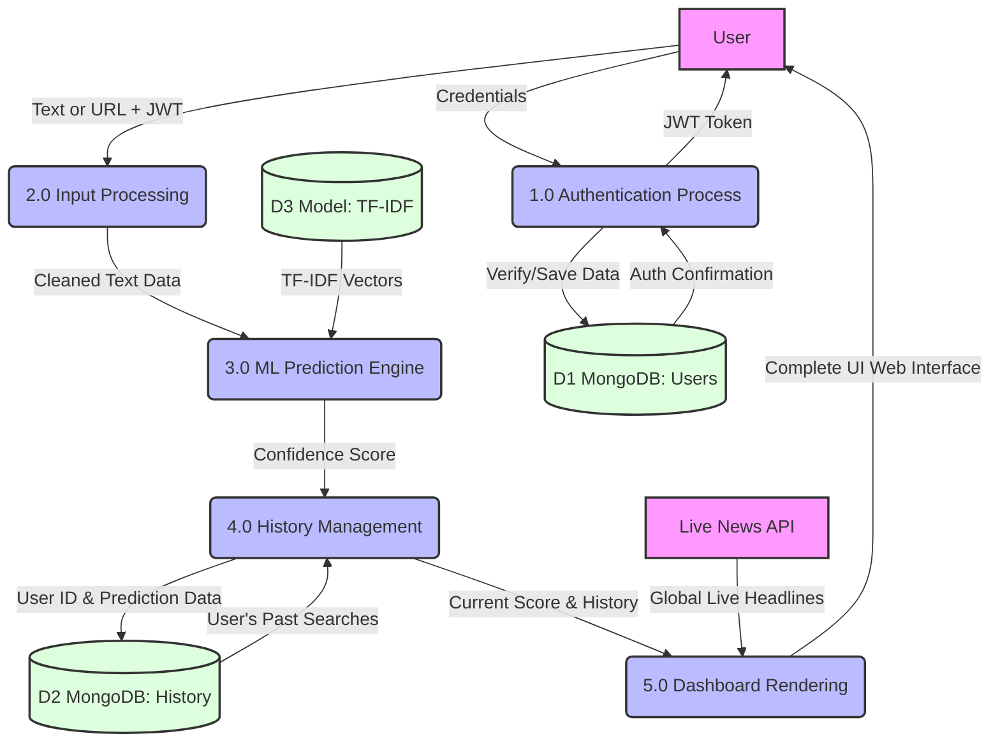

# TruthLens Intelligence: Review 2 Data Flow Diagram (DFD)

Here is the Level 1 Data Flow Diagram illustrating the core workflow, data processes, and storage interactions completed during the Review 2 phase.

### DFD Components Explained:
- **Entities (Pink):** The `User` interacts with the system, and the external `Live News API` feeds real-time data into the dashboard.
- **Processes (Blue):** Represent the core Flask logic created in Review 2 (handling tokens, extracting URLs, running the ML model, and rendering templates).
- **Data Stores (Green):** Represents the MongoDB collections mapping users and their histories, as well as the Machine Learning model file used for text vectorization.
