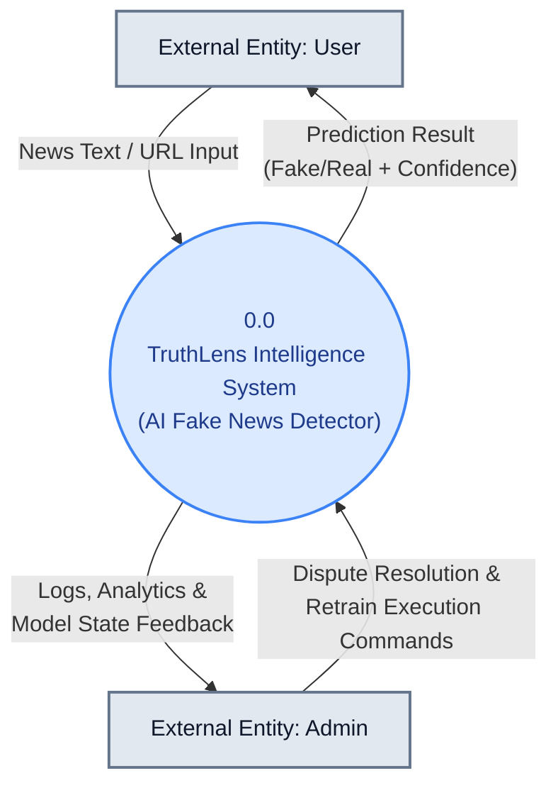
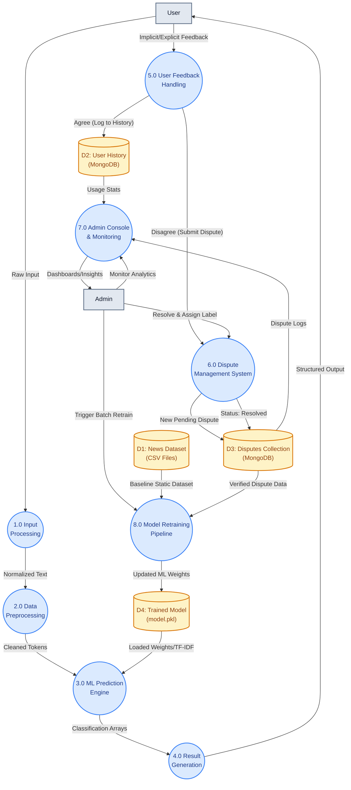
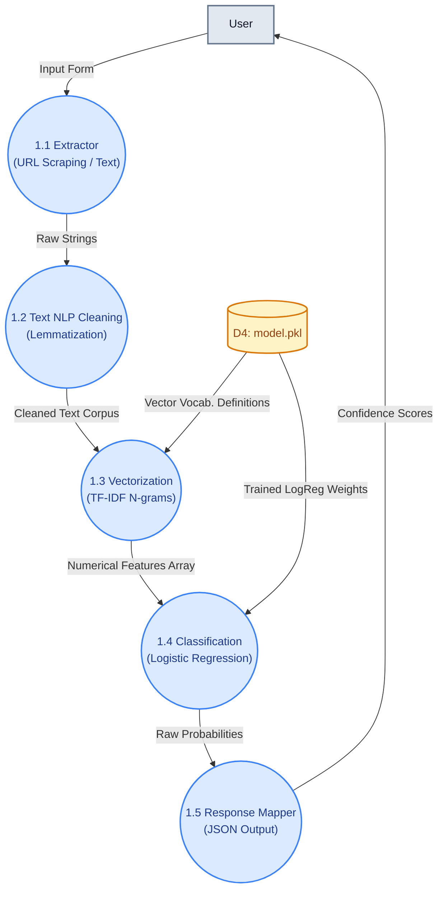
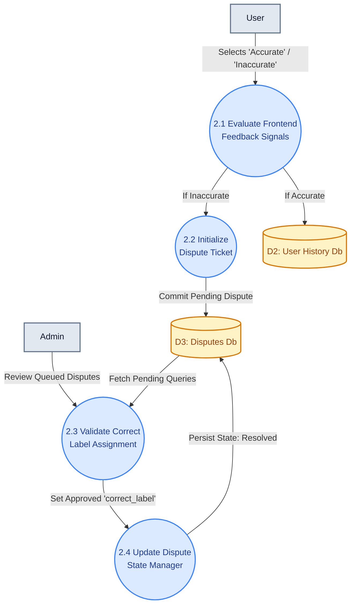
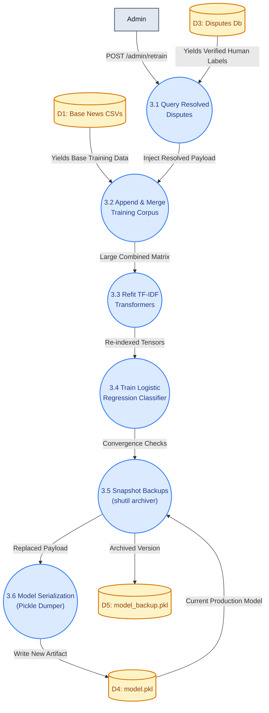

# TruthLens Intelligence: Data Flow Diagrams (DFD)

This document contains standard Data Flow Diagrams spanning three depth levels, meticulously designed for Academic Submission (Review 3). 

**Diagram Key & Symbology:**
- **Rectangles (Gray):** External Entities (User, Admin)
- **Circles (Blue):** Processes and Compute Subsystems
- **Databases (Yellow):** Data Stores (MongoDB, CSVs, Pickle Files)
- **Arrows:** Directional Data Exchanges

---

## ✦ LEVEL 0: Context Diagram
*Provides a high-level overview of the entire system boundary and its relationships with external entities.*

---

## ✦ LEVEL 1: System Breakdown
*Deconstructs the system into its primary subsystems: ML Prediction Engine, Dispute Systems, and the Retraining Pipeline.*

---

## ✦ LEVEL 2: Detailed Internal Workflows
*Zooms into the critical individual processes demonstrating text logic and database maneuvers step-by-step.*

### A. Prediction Flow

### B. Feedback & Dispute Validation Flow

### C. Retraining & Overwrite Flow

